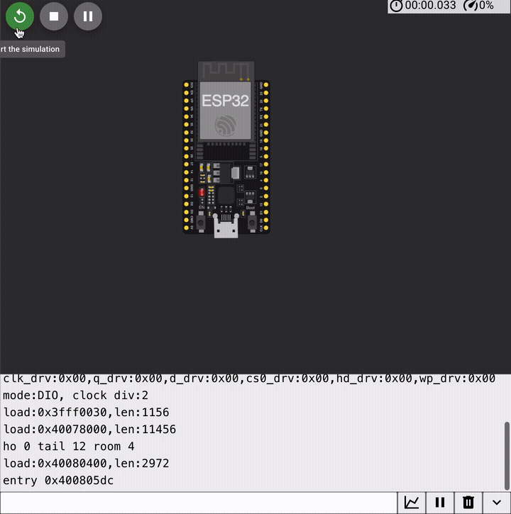

# freertos-task-architecture

A four-task FreeRTOS application on a dual-core ESP32 (ESP-IDF v5.3) — sampler,
aggregator, uplink, supervisor — where every byte's home and every task's headroom is
measured, not guessed: the firmware audits its own stack margins, demonstrates priority
inversion with numbers on both lock types, and proves the stack-overflow canary works by
tripping it on demand in CI.



## Run it in your browser

Wokwi project: **https://wokwi.com/projects/474954927923025921** — type `hwm`, `inv`, then
`crash` into the serial monitor (the input bar is the strip at the very bottom). The
browser project runs `browser-demo/sketch.ino`, a clearly-labeled Arduino-core port,
because browser Wokwi cannot compile ESP-IDF; the four tasks, both lock types and all
three commands port directly. If the port and `main/` ever disagree, `main/` is right.

**Locally:**

```bash
make -C test               # host tests: the aggregation core, gated at 100% branch
idf.py build               # ESP-IDF v5.3
idf.py flash monitor       # then type: hwm | inv | crash
```

## What it does

- `sampler` (core 1, prio 4) synthesizes 100 Hz samples into a **stream buffer**.
- `aggregator` (core 1, prio 3) folds 1 s windows (min/max/mean) and queues results.
- `uplink` (core 0, prio 3) drains the **queue** and transmits (prints).
- `supervisor` (core 0, prio 5) owns the **event group** (per-task liveness bits), the
  task-watchdog feed, and a serial shell: `hwm`, `inv`, `crash`.

## What this demonstrates

- **Ownership discipline**: the stream buffer is restricted to one writer and one reader —
  stated where it is created ([main/main.c](main/main.c)), same discipline that made
  [project 02's SPSC ring buffer](https://github.com/DwalloE/spsc-ring-buffer-esp32)
  lock-free. Results cross a copy-by-value queue instead, and the code says why.
- **Deliberate core affinity**: data plane on core 1, control plane on core 0, one
  sentence of rationale per pin decision, in the code.
- **Stack sizing as arithmetic, not folklore**: declared sizes live in one table
  ([main/stacks.h](main/stacks.h)); `hwm` re-measures every task with
  `uxTaskGetStackHighWaterMark` and the firmware itself asserts every margin — CI waits
  for its `hwm: all margins OK` line.
- **Priority inheritance, measured**: `inv` runs the same three-task inversion on a binary
  semaphore and on a mutex and prints both blocked times and the ratio
  ([main/inversion.c](main/inversion.c)).
- **Where the bytes live**: [docs/linker-map.md](docs/linker-map.md) reads this build's
  `.map` — section sizes, the ten biggest symbols, and what moving one buffer from stack
  to static does to `.bss` and to the owning task's stack requirement.
- **Translation fluency**: [docs/mapping-to-zephyr.md](docs/mapping-to-zephyr.md) restates
  the whole architecture in Zephyr and ThreadX vocabulary.

## The bug gallery

- **The canary catches the deliberate overflow.** `crash` spawns a 2048-byte-stack victim
  that recurses past its end; the canary check panics **naming the task**:

  ```text
  (the CI-captured panic lands here after the first simulate run)
  ```

  The fix is the discipline the rest of the repo practices: declared sizes derived from
  measured high-water plus an enforced margin, re-audited by `hwm` on every CI run.
- **The inversion numbers.** Binary semaphore vs mutex, same tasks, same core
  — measured figures from the CI run land here (structure: the semaphore round's blocked
  time balloons toward the 300 ms spin; the mutex round collapses to ≈ the 50 ms hold).
- **The overflow demo that took three tries** — the strongest argument in this repo for
  CI that *requires* the panic. **v1** recursed by high-water mark and stopped *while
  headroom remained*: the victim parked ~200 bytes short of the canary and never
  panicked (caught in the browser demo's screen recording — `crash: victim task up...`
  then silence, twice). **v2** plunged a blind 512-byte frame "just past" the edge:
  it overshot the stack into the heap, the victim wedged spinning (`E task_wdt: CPU 1:
  victim`), starved the aggregator (`task stalled: alive bits 0x5`), and there was
  *still* no canary panic — the canary only sees writes that cross the stack's edge,
  not carnage beyond it (CI run 34690787832, `wokwi-serial-crash.log`). **v3** asks the
  kernel where the stack actually ends (`vTaskGetInfo` → `pxStackBase`) and stomps from
  the live frames exactly down to that base: full genuine overflow, canary included,
  zero collateral damage, deterministic panic. Both failed versions passed a casual
  eyeball test; only a scenario that demands the panic text told the truth.
- **The orchestrator that starved itself.** In the Arduino-core port, `inv` measured
  **9 µs blocked on both rounds** — no spike, nothing to collapse. `loop()` (the
  orchestrator) runs on core 1 at priority 1 in the Arduino core, the same core the
  experiment pinned its participants to; during `low`'s 50 ms lock hold the orchestrator
  was starved, so the high-priority waiter was only created after the lock was already
  free. Fix: participants on core 0, orchestrator on core 1. The ESP-IDF firmware never
  had this bug — its supervisor lives on core 0 — but it is the same lesson the demo
  teaches: a lower-priority task sharing a core with spinners does not run.

## How it is tested


- **Host job**: the aggregation arithmetic (`main/agg_core.h` is IDF-free on purpose) —
  fold edges, mean rounding, full-scale windows, the wire layout, the synthetic source —
  under a 100% branch-coverage gate. No TSan stage, deliberately: the RTOS owns this
  project's concurrency, and a gate that tests nothing is worse than no gate.
- **Build job**: ESP-IDF v5.3, plus `idf.py size`/`size-components` printed every run so
  the linker-map doc stays traceable; the `.map` ships as an artifact.
- **Healthy scenario** (Wokwi CI, typed live over serial): requires the firmware's own
  `hwm: all margins OK` and `inv: inheritance OK` verdict lines, then the `t=10s`
  heartbeat — every run outlives the 5 s task watchdog.
- **Crash scenario**: reaches `t=10s` healthy, types `crash`, and **requires** the canary
  panic naming the victim task — the safety net is a tested claim, not a config line.

## Honest limits

- **Timing numbers are simulated-scheduler numbers.** Wokwi's scheduler is not silicon:
  interrupt load, flash cache misses and real dual-core contention will move the
  microseconds. The *structure* of the inversion result — spike vs no spike — is the
  claim, not the digits.
- **The workload is synthetic.** A triangle wave stands in for an ADC; there is no real
  sensor, radio, or bus contention here.
- **The stack numbers are for THIS build and THIS compiler.** High-water marks move with
  optimization level, IDF version, and every code change — which is exactly why the margin
  is asserted in CI instead of written down once and trusted.

## Why this project exists

Part of an [11-project embedded portfolio](https://github.com/DwalloE/embedded-portfolio).
"Where do your bytes live?" and "what does a mutex buy you over a semaphore?" are
interview staples; this repo answers both with measurements a reviewer can re-run in a
browser.

## Layout

```text
main/agg_core.h            the window fold - pure C, host-tested at 100% branch
main/main.c                supervisor: wiring, shell, hwm audit, watchdog feed
main/sampler.c             synthetic ADC -> stream buffer     (core 1)
main/aggregator.c          stream buffer -> 1 s windows -> queue (core 1)
main/uplink.c              queue -> "radio" (printf)          (core 0)
main/inversion.c           the inv experiment, both lock types, verdict line
main/crash.c               the canary demo's victim
main/stacks.h              every declared stack size + the enforced margin
test/                      host tests + the branch-coverage gate
docs/linker-map.md         where the bytes live, from this build's .map
docs/mapping-to-zephyr.md  the same architecture in Zephyr / ThreadX words
browser-demo/sketch.ino    Arduino-core port for the shareable Wokwi project
wokwi-ci.scenario.yaml     healthy run: hwm + inv verdicts + heartbeat
wokwi-crash.scenario.yaml  crash run: the canary panic, required
```

MIT licensed.
